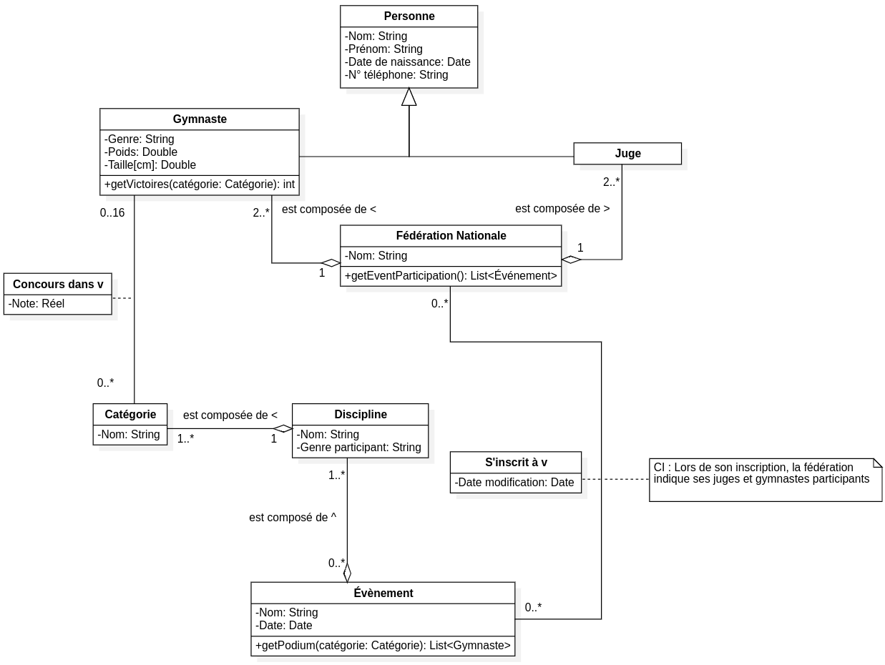

# Rapport Labo 03: Fédération Internationale de Gymnastique

## Introduction

Ce rapport présente une modélisation UML visant à représenter le fonctionnement des événements sportifs organisés et gérés par la Fédération Internationale de Gymnastique (FIG). Ce modèle prend en compte la gestion des fédérations nationales, des gymnastes, des juges, des disciplines, des catégories et des événements sportifs. Il décrit également les opérations et les interactions liées aux inscriptions aux événements, aux performances des gymnastes et aux résultats des compétitions.

### Description

La Fédération Internationale de Gymnastique (FIG) gère des événements sportifs internationaux dans lesquels des fédérations nationales peuvent inscrire leurs gymnastes et leurs juges. Les événements incluent plusieurs disciplines qui sont divisées en différentes catégories. Chaque gymnaste participe à une ou plusieurs catégories et leurs performances sont notées par les juges. Les résultats permettent de déterminer les podiums et les victoires des gymnastes dans chaque catégorie.

### Diagramme UML

Le diagramme UML ci-dessous illustre la structure des classes représentant les fédérations nationales, les gymnastes, les juges, les disciplines, les catégories et les événements sportifs.

### Explication des choix de modélisation

1. **Personne** :
   - *Attributs* : La classe `Personne` factorise les attributs communs entre les gymnastes et les juges, tels que le nom, le prénom, la date de naissance et le numéro de téléphone.
   - *Héritage* : Les classes `Gymnaste` et `Juge` héritent de `Personne`, centralisant ainsi les informations partagées entre ces deux types d'individus.

2. **Fédération Nationale** :
   - *Attributs* : Chaque fédération nationale est définie par son nom et peut participer à plusieurs événements. La méthode `getEventParticipation()` permet de retourner la liste des événements où la fédération a participé.
   - *Associations* : Une fédération nationale est composée de plusieurs gymnastes et juges (cardinalité "2..*"), et elle peut s'inscrire à plusieurs événements. La fédération est représentée par une relation de composition avec ses gymnastes et juges.

3. **Gymnaste** :
   - *Attributs* : Un gymnaste est défini par son genre, son poids, et sa taille, en plus des attributs hérités de `Personne`. La méthode `getVictoires()` permet de calculer le nombre de victoires du gymnaste dans une catégorie donnée.
   - *Associations* : Un gymnaste est associé à une ou plusieurs catégories via la relation "Concours dans", avec une limite maximale de 16 gymnastes par catégorie.

4. **Juge** :
   - *Attributs* : Les juges héritent de la classe `Personne` et sont rattachés à une fédération nationale. Ils participent aux événements pour noter les gymnastes.
   - *Associations* : Une fédération nationale est composée d'au moins deux juges (cardinalité "2..*"), qui participent aux événements auxquels la fédération est inscrite.

5. **Discipline** :
   - *Attributs* : Chaque discipline est caractérisée par un nom et le genre des gymnastes qui peuvent y participer. Une discipline regroupe plusieurs catégories.
   - *Associations* : Une discipline est composée d'une ou plusieurs catégories (relation "1..*"). Elle est également liée aux événements auxquels elle est présentée.

6. **Catégorie** :
   - *Attributs* : Une catégorie est définie par son nom et est associée à une discipline. Elle est liée à plusieurs gymnastes qui y participent, avec une limite maximale de 16 participants par catégorie.
   - *Associations* : Chaque catégorie appartient à une discipline (relation "1") et est liée aux gymnastes par la relation "Concours dans".

7. **Événement Sportif** :
   - *Attributs* : Un événement est défini par son nom et sa date. Il est également associé à plusieurs disciplines et conserve une méthode `getPodium()` pour retourner les trois meilleurs gymnastes dans une catégorie donnée.
   - *Associations* : Un événement est composé de plusieurs disciplines, chacune étant elle-même composée de catégories. Les fédérations s'inscrivent à des événements, incluant leurs gymnastes et juges.

8. **Inscription à un événement** :
   - *Attributs* : L'entité `S'inscrit à` représente l'inscription d'une fédération nationale à un événement. Elle est caractérisée par la date de modification de l'inscription.
   - *Associations* : Cette entité relie une fédération à un événement, avec l'obligation de spécifier les juges et gymnastes participants lors de l'inscription (relation de cardinalité "1..*").
   - *Contraintes d'intégrité* : Lorsqu'une fédération s'inscrit à un événement, elle doit fournir la liste des juges et des gymnastes participants, et chaque juge et gymnaste doit appartenir à la fédération qui les inscrit.

9. **Notes et Podium** :
   - *Attributs* : Chaque gymnaste reçoit une note sous forme de réel pour sa participation dans une catégorie. La méthode `getPodium()` retourne les trois meilleurs gymnastes dans une catégorie donnée lors d'un événement spécifique.

### Méthodes nécessaires

1. `getEvenementsParticipe(FederationNationale) -> List<Evenement>` :
   - Retourne la liste des événements où une fédération nationale a participé.

2. `getPodium(Categorie, Evenement) -> List<Gymsnaste>` :
   - Retourne le podium (les trois premiers gymnastes) pour une catégorie lors d'un événement donné.

3. `getNbVictoires(Gymnaste, Categorie) -> int` :
   - Retourne le nombre de victoires d'un gymnaste dans une catégorie donnée.

### Contraintes d'intégrité

1. Une fédération nationale doit avoir au moins deux gymnastes et deux juges pour s'inscrire à un événement (selon la donnée)
2. Le genre du gymnaste doit correspondre à celui requis par la discipline pour qu'il puisse concourir.
4. Un événement qui inclut une discipline inclut nécessairement toutes les catégories de cette discipline.

## Conclusion

Ce modèle UML permet de structurer les informations relatives aux événements sportifs de la FIG, en prenant en compte la gestion des fédérations, des disciplines, des catégories et des performances des gymnastes. Il répond aux besoins d'opérations complexes comme la gestion des inscriptions et le calcul des podiums, tout en assurant des contraintes d'intégrité essentielles au bon déroulement des compétitions.
